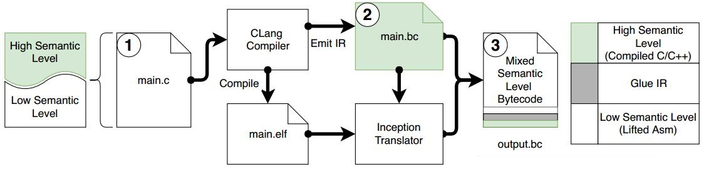
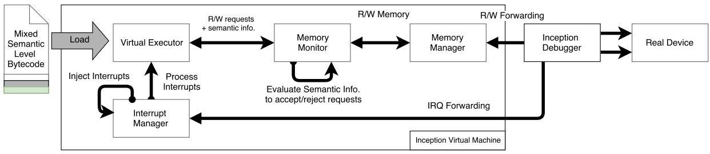
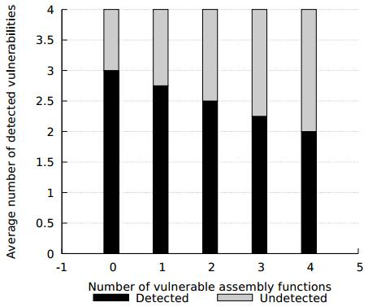
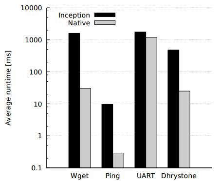
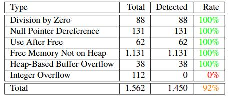

# **论文笔记**

**题目**：Inception_ System-Wide Security Testing of Real-World Embedded Systems Software

**出处**：USENIX Security 2018

**作者**：Nassim Corteggiani, EURECOM, Maxim Integrated; Giovanni Camurati and Aurélien Francillon, EURECOM

**单位**：Maxim Integrated and EURECOM

**原文**：[https://www.usenix.org/system/files/conference/usenixsecurity18/sec18-corteggiani.pdf](https://www.usenix.org/system/files/conference/usenixsecurity18/sec18-corteggiani.pdf)

**相关材料**：[会议](https://www.usenix.org/conference/usenixsecurity18/presentation/corteggiani), [Slides](https://www.usenix.org/sites/default/files/conference/protected-files/security18_slides_corteggiani.pdf),
[MP3](https://2459d6dc103cb5933875-c0245c5c937c5dedcca3f1764ecc9b2f.ssl.cf2.rackcdn.com/sec18/corteggiani.mp3)

## **一、背景**

&ensp;&ensp;&ensp;&ensp;嵌入式系统在我们的日常生活中被广泛使用，它是一套软件与硬件的集成体，被应用于生活的各个方面，解决人们的日常需求。它不同于我们平时使用的通用操作系统（例如 Windows 或者是 Linux 等），它的功能相对比较简单，在特定的场合只需要解决某一个特定的问题即可。但是它们都需要一个微处理器，用于控制整套嵌入式系统，并且通常需要连接网络，又由于它们遍布生活的各个角落，这就使得它们的安全性备受人们所关注。一旦这些嵌入式设备被黑客所控制，就很容易造成大规模的攻击（例如DDOS攻击等）。

## **二、提出的方法以及解决的问题**

&ensp;&ensp;&ensp;&ensp;基于上述的背景，作者开发出了一种新的检测工具 -- Inception，用于检测嵌入式系统中的固件的安全性，尽量减少固件中存在的、潜在的、可能的漏洞，提高嵌入式系统的安全性、可靠性。嵌入式系统的安全性检测，目前大都是基于源码检测，或者是基于二进制检测，但是，对于嵌入式系统固件来说，直接检测二进制形式的固件，技术难度相对比较大（因为源码的语义信息已经丢失）；而如果直接检测固件的源代码，又存在另外一个问题：那就是这些固件的源码经常会混杂一些汇编代码，使得很多的源码检测工具都不能直接处理这些汇编代码。因此，作者提出了一个基于IR（Intermediate Representation）的安全检测工具，用于检测嵌入式设备中的固件的安全性。

## **三、技术方法**

&ensp;&ensp;&ensp;&ensp;由于 Inception 是一个基于符号执行的固件检测工具，因此，作者把它划分为三个部分来实现，分别是：Inception Translator、Inception Symbolic Virtual Machine 和 Inception Debugger。

- Inception Translator 用于生成统一的 LLVM-IR 代码，它把高级的源代码（通过 CLang Compiler）翻译成中间结果（IR）,也把低级的汇编代码（通过 Disassembler）翻译成 IR， 然后通过一个 lift-and-merge 程序把它们的 IR 合并到一起，形成混合的 LLVM-IR 代码，同时，也把 ARMv7-M 架构的硬件相关机制也考虑进来。
- Inception Symbolic Virtual Machine 是一个可以运行 LLVM-IR 代码的、基于 KLEE 的符号执行虚拟机，作者用它来执行 Inception Translator 生成的混合 IR 代码，它通过不同的策略，可以处理不同级别的内存抽象（memory abstraction），并且还可以与外围设备进行交互，处理中断等。
- Inception Debugger 是一个高性能的、基于 JTAG 的调试器，它附加在 USB3.0 总线上，可以高速的访问外围设备，并能够重定向内存访问到真实的硬件设备当中。

&ensp;&ensp;&ensp;&ensp;&ensp;&ensp;&ensp;&ensp;&ensp;&ensp;&ensp;&ensp;&ensp;&ensp;&ensp;&ensp;&ensp;&ensp;&ensp;&ensp;&ensp;&ensp;&ensp;&ensp;&ensp;&ensp;&ensp;&ensp;&ensp;&ensp;图 1： Inception Translator 的执行流程

&ensp;&ensp;&ensp;&ensp;如图 1 所示，是 Inception Translator 的执行流程，main.c 源文件中包含了源代码，并且源代码中还包含了汇编代码，然后通过 Clang 编译器生成 IR 代码和 ELF 文件，最后通过 Inception Translator 把二者合并，生成混合的 IR 代码。

&ensp;&ensp;&ensp;&ensp;&ensp;&ensp;&ensp;&ensp;&ensp;&ensp;&ensp;&ensp;&ensp;&ensp;&ensp;&ensp;&ensp;&ensp;&ensp;&ensp;&ensp;&ensp;&ensp;&ensp;&ensp;&ensp;&ensp;&ensp;&ensp;&ensp;图 2： Inception Symbolic Virtual Machine 的执行流程

&ensp;&ensp;&ensp;&ensp;如图 2 所示，是 Inception Symbolic Virtual Machine 的执行流程，它加载 Inception Translator 翻译过来的中间代码，使用 Virtual Executor 执行，该虚拟机还包括了 Interrupt Manager、Memory Manager 和 Memory Moniter，并结合 Inception Debugger，把对外围设备的访问重定向到真实设备当中。

## **四、实验评估**

### **1. 源码中漏洞数量检测**

&ensp;&ensp;&ensp;&ensp;作者使用的测试集是：[Klocwork Test Suite](https://samate.nist.gov/SRD/view.php?tsID=106) for C/C++，这个测试集中包含了 out-of-bound、overflow 和 wrong dynamic memory management errors。在 40 个人工合成的测试样例中，有 70% 的漏洞被检测出来，并且没有误报的情况。

### **2. 二进制中漏洞数量检测**

&ensp;&ensp;&ensp;&ensp;&ensp;&ensp;&ensp;&ensp;&ensp;&ensp;&ensp;&ensp;&ensp;&ensp;图 3： 在固件 EXPAT XML parser 中检测漏洞数量

&ensp;&ensp;&ensp;&ensp;图 3 是在固件 EXPAT XML parser 中的检测结果，该固件中的每一种漏洞类型都有特定的触发条件，但是由于符号执行引擎的约束求解能力有限，因此，有些漏洞是由于引擎原因不能被检测出来。作者把固件的输入标记为符号值，并把超时设置成90秒，检测结果如图 3 所示，随着包含漏洞的汇编函数的数量增加，被检测到的漏洞的数量会逐渐下降。

### **3. 时间开销**

&ensp;&ensp;&ensp;&ensp;&ensp;&ensp;&ensp;&ensp;&ensp;图 4： Native Execution 与 Inception 的时间开销比较

&ensp;&ensp;&ensp;&ensp;图 4 是 Native Execution 与 Inception 的时间开销比较，比较的环境是：libusb-0.1-4, Ubuntu16.04 LTS, Intel Corporation 8 Series/C220 USB Controller，测试 ICMP 与 HTTP 协议的测试集是：[Web example for the LPC1850 board](https://diolan.com/media/wysiwyg/downloads/lpc1800-demos.zip)，测试 UART 协议的测试集是： STM32 板的驱动程序，并且所有的测试都使用真实的外围设备（对外围设备的访问都重定向到真实的外围设备中）。从测试结果来看，Inception 的时间开销相对于 Native Execution 是比较大的。

### **4. 项目代码测试**

&ensp;&ensp;&ensp;&ensp;&ensp;表 1：基于 FreeRTOS 系统和  Juliet 1.3 测试套件的 Corruption 检测结果

&ensp;&ensp;&ensp;&ensp;表 1 是基于 [FreeRTOS 系统](https://www.freertos.org/)和  [Juliet 1.3 测试套件](https://samate.nist.gov/SRD/around.php#juliet_documents)的 Corruption 检测结果，检测的目标包括：divide by zero、null pointer dereference、free memory not on heap、use after free、integer overflow 和 heap-based buffer overflow。从表中可以看出，除了 integer overflow 不能被检测出来之外，其它的都能被检测出来，作者说：这是由于 KLEEv1.3 还不支持检测整型溢出类型的漏洞。

## **五、优缺点**

### **优点：**

- Inception 比较好的处理了源码中包含汇编代码的情况，这对于嵌入式设备固件的检测是一个极大的优点。
- 作者改造的基于KLEE的虚拟机，可以把代码中对硬件的访问重定向到真实的设备中，这样可以得到更好地测试效果与测试结果。
- 由于源码中的内存模型与汇编代码中的内存模型是不一样的，因此，把它们直接放入符号执行引擎中是无法执行的，于是，作者把它们的内存模型统一化，使得它们能够在符号执行引擎中执行。
- Inception 可以把源代码编译成汇编代码，再测试这些汇编代码，但是它有一个优点就是，它在测试汇编代码的过程中，还可以利用源代码中的语义信息，使得它的测试结果更加精确，这种情况在特定的场合下特别有用，比如，在开发的过程中，有时候自己写的代码可能没有问题，但是被编译过后，编译器可能会优化掉某些代码，使得原来没有问题的代码可能会产生意想不到的后果，导致程序出错，这时候可以利用 Inception 来检测这些代码，可能会产生比较好的效果。

### **缺点：**

- 作者在测试过程中也给出了一个很明显的缺点，就是 Inception 暂时还不支持检测整型溢出这种类型的漏洞。
- 由于作者的这个工具是基于一个符号执行引擎 KLEE 之上实现的，因此，也就存在一些内在的缺陷，例如符号执行可能会导致路径爆炸、资源消耗过大等。
- 作者在文章中几乎没有描述检测漏洞的机制，比如如何检测 Double Free 等。

## **六、个人观点**

&ensp;&ensp;&ensp;&ensp;在这篇文章中，作者详细的阐述了他的嵌入式系统固件检测工具 -- Inception，与别的工具不同的是，它把源代码和内嵌的汇编代码都翻译成中间语言（IR），使得它们都具有统一的内存模型，能够在符号执行引擎 KLEE 之上执行。它即可以检测源代码，也可以检测二进制代码，同时还能够利用源代码中的语义信息来检测编译好的二进制代码，这是这个工具的一个特色，也是源于实际的固件代码（源代码中含有内嵌的汇编代码）。不过，作者在这篇文章中主要讲解的是 Inception 的三个组成部分：Inception Translator、Inception Symbolic Virtual Machine 和 Inception Debugger，好像并没有太多的描述他是怎么检测漏洞的（比如如何检测空指针解引用等），只是提到他们能够检测这些漏洞，这部分工作应该也要介绍一下才对，至少应该做一个简短的介绍，让读者对这部分有个了解。
