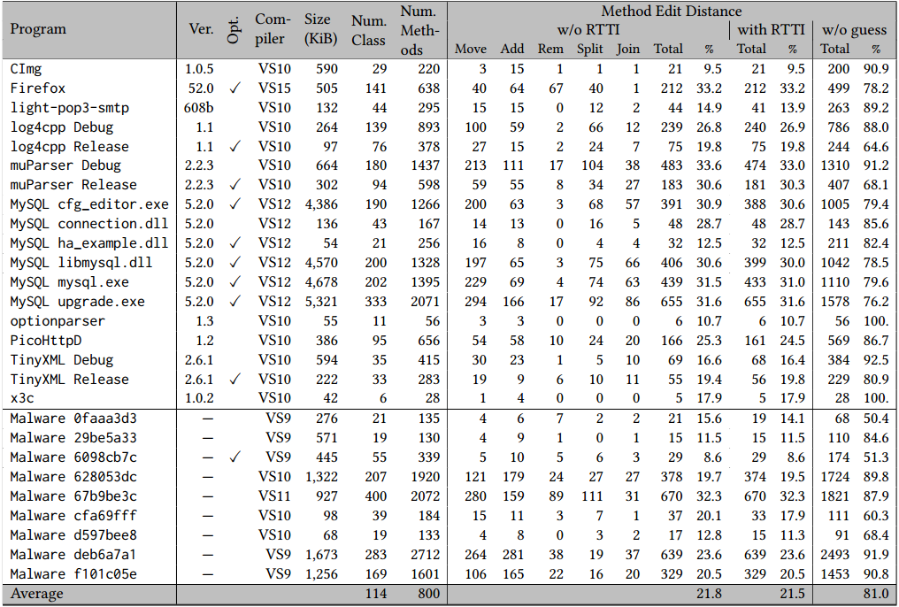
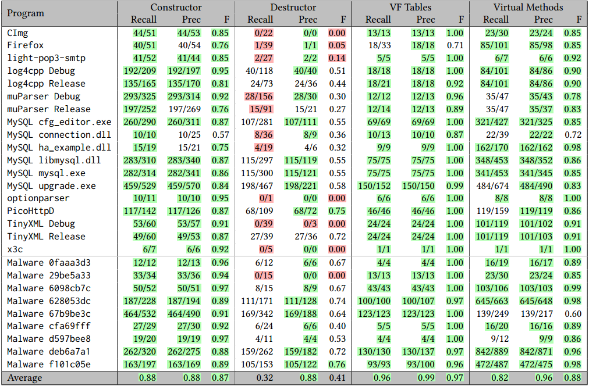

# **论文笔记**

**题目**：Using Logic Programming to Recover C++ Classes and Methods from Compiled Executables

**出处**：ACM CCS 2018

**作者**：Edward J. Schwartz, Cory Cohen, Jeff Havrilla, Jeff Gennari, Charles Hines, Michael Duggan

**单位**：Carnegie Mellon University

**原文**：[https://dl.acm.org/citation.cfm?id=3243793](https://dl.acm.org/ft_gateway.cfm?id=3243793&ftid=2008887&dwn=1&CFID=28078949&CFTOKEN=6f2847be4e4e4af0-0D0A672B-9EFE-2B47-6282648D692F0E0A)

**相关材料**：[会议](https://www.sigsac.org/ccs/CCS2018/program/), [GitHub项目地址](https://github.com/cmu-sei/pharos)

## **一、背景**

&ensp;&ensp;&ensp;&ensp;随着计算机硬件的发展，计算机软件也变得越来越庞大、越来越复杂。而为了开发这些复杂的计算机软件，软件工程师们逐渐把方向转向了面向对象 OO（Object Oriented）的编程语言，例如 C++ 等高级开发语言。这些高级的编程语言，对于开发庞大、复杂的应用程序，它可以提供一种高级抽象的框架（Natural Framework），使得面向对象的编程语言更加适用于构造复杂的数据结构 -- Class。类可以把相关的数据成员和一组对数据成员进行操作的方法绑定在一起，这样的绑定方式极大的方便了 C++ 代码的维护与管理，使得开发者更容易、更高效地开发复杂的应用程序。

&ensp;&ensp;&ensp;&ensp;虽然类可以给开发者带来极大的便利，但是，万事万物总有两面性，类也一样，它给开发者带来便利的同时，也给软件逆向分析工程师带来了不便，使得分析师在分析 C++ 开发的程序的难度有所提高，特别是在分析恶意程序的时候，分析 C++ 开发的恶意程序变成了一项更高难度的挑战。因此，如何从恶意程序中恢复出代码的高级抽象特性（例如类等），成为了一项值得深究的工作。

## **二、提出的方法以及解决的问题**

&ensp;&ensp;&ensp;&ensp;基于上述的背景，作者提出了一种新的二进制分析工具 -- OOAnalyzer，用于分析 C++ 所开发出来的程序，特别是针对恶意软件的分析，该工具可以起到很好的辅助作用，极大的方便了软件分析工程师对软件的分析，使得分析师在分析 C++ 程序的时候，可以快速的掌握程序中的相关类之间的关系（比如继承关系等），并且快速了解各个类内部的各个组成部分（例如方法、数据成员、虚函数表（VFTable）、构造函数与析构函数等）。

## **三、技术方法**

&ensp;&ensp;&ensp;&ensp;分析 C++ 所开发的应用程序，主要是分析出程序中的数据与方法之间的关系，即从二进制文件中恢复出程序的高级抽象结构 -- 类。如果有办法可以很方便的从二进制文件中恢复出程序中类的结构，让分析者能够知道各个类之间的关系，并且知道类中所包含的方法、数据成员、虚函数表（VFTable）、构造函数与析构函数等信息，这就可以使得分析者很容易的分析出该程序所具有的功能与用途，并且快速掌握程序的执行过程，完成程序分析任务。很可惜的是，目前没有一个高效的工具能够实现这样的功能，因此，OOAnalyzer 就诞生了，它的目的就是从二进制文件中恢复出程序中类的结构，尽可能的恢复出每一个类之间的关系，以及各个类所包含的各种信息等。该工具是基于逆向工程师在逆向分析程序的时候所采用的一般步骤和方法，并把这些方法和步骤用代码来实现，使之能够自动化的帮助分析师分析程序，并且还可以实现大规模分析、分析大型应用程序（例如FireFox、MySQL等）等。该工具中所包含的核心方法有：

- 在二进制代码中识别简单的模式（Patterns）；
- 基于这些模式，使用逻辑推理并结合相关领域的专业知识，甚至是一些直觉（Intuition）等方法来分析目标程序；
- 分析过程包括使用一个轻量级的符号执行引擎和一个基于 Prolog 的推理系统，把分析师的分析行为转化为代码的形式，集成在 OOAnalyzer 当中。

&ensp;&ensp;&ensp;&ensp;&ensp;&ensp;&ensp;&ensp;&ensp;&ensp;&ensp;&ensp;&ensp;&ensp;&ensp;&ensp;&ensp;&ensp;&ensp;&ensp;&ensp;&ensp;&ensp;&ensp;&ensp;&ensp;图 1： OOAnalyzer 的执行流程

&ensp;&ensp;&ensp;&ensp;如图 1 所示是 OOAnalyzer 的执行流程，OOAnalyzer 的最终目标就是从一个 C++ 开发的可执行文件中恢复出 C++ 代码的抽象信息（类的相关信息）。对于一个 C++ 开发的可执行文件，OOAnalyzer 首先对它执行 Fact Exporter 操作，生成初始的 Facts（比如函数调用、带对象指针的方法调用、创建和使用对象等行为） -- Initial Facts。这里的 Fact Exporter 使用的是一个轻量级的符号分析引擎（[Pharos binary analysis framework](https://github.com/cmu-sei/pharos)）来实现语义分析和反汇编等操作。这里得到的 Facts 虽然不是完全正确可信的，但是它是后序操作的基础，它也需要被后序的操作来证实和验证自己。

&ensp;&ensp;&ensp;&ensp;第一步得到了基础的 Facts 之后，OOAnalyzer 把它当做一个 Fact base，并开始执行基于 Prolog 的推理模块，该模块包含三个核心组成部分：Forward Reasoning、 Hypothetical Reasoning 和 Consistency Checking。其中，Forward Reasoning 内部包含了一系列的规则，这些规则都是基于 Fact base，并且由一些**前提条件**（Precondition）和**结论**（Conclusion）组成，通过查找程序，只要找到满足所有前提条件的结构存在，就可以把相应的数据结构归结为某一个特定的结论（比如构造函数等），生成一个对应的 fact（此处称之为 Entity fact，包括方法，虚函数表，类之间的关系，类的大小等），并加入到 Fact base 中，如此来不断的扩大 Fact base。

&ensp;&ensp;&ensp;&ensp;在 Forward Reasoning 推理过程中可能对某些情况无法做出判断（这种情况称之为：Ambiguous properties），因此需要 Hypothetical Reasoning 来辅助推理分析，这个 Hypothetical Reasoning 也是 OOAnalyzer 的最关键一个部分，有了这个模块，才使得 OOAnalyzer 的分析能力有了非常大的提高（平均错误率从 81% 下降到 21.8%）。OOAnalyzer 通过一些 Hypothetical Reasoning Rules 来猜测（Educated guess）这些不确定的属性（Ambiguous properties），提出一些 Guesses 和 Assumptions， 以使得 OOAnalyzer 在分析的过程中可以不间断的执行下去。

&ensp;&ensp;&ensp;&ensp;经过前面两步操作之后，OOAnalyzer 已经得到了一个比较完整的 Fact base， 但是在这个 Fact base 中，可能会产生互相冲突的情况（因为 Hypothetical Reasoning 可能会做出错误的假设和猜测），因此，还需要做一个一致性的检查（Consistency Checking），以解决这些不一致的情况。这里的 Consistency Checking 会按照一些特定的规则，当检测到 Inconsistency 的时候，就开始从最近的一个猜测（Last guess）开始回退分析（backtrack）来检测并解决 Fact base 中产生的冲突和不一致的情况，使得最终得到的 Fact base 中的每一个 fact 都不会互相冲突。

&ensp;&ensp;&ensp;&ensp;当前面的所有步骤都顺利完成，并且没有残留的 Inconsistency 和 Proposed Guess 的时候，OOAnalyzer 就会把这个最终的模型展示给分析者。

## **四、实验评估**

&ensp;&ensp;&ensp;&ensp;作者的实验环境是：使用单核的 Intel Xeon E5-2695@2.4Ghz 的 CPU ，并且配置了 256GB 的内存。主要评估 OOAnalyzer 对 C++ 类的识别与类中的方法（包括构造函数、析构函数、虚函数等）的识别，以及 OOAnalyzer 的时间与空间开销。作者评估 OOAnalyzer 所使用的测试集是 27 个 32 位的 PE 可执行程序，包括 18 个 Cleanware 和 9 个 Malware， 在 18 个 Cleanware 中，还包括了两个大型的应用程序： FireFox 和 MySQL。同时，作者使用编辑距离（Edit Distance）来衡量一个方法是否属于某一个具体的类。此外，为了证明测试结果的正确性，作者通过解析每一个程序的 PDB 文件（由 Visual C++ 产生的一个符号文件）来验证。

### **1. 编辑距离（Edit Distance）**

&ensp;&ensp;&ensp;&ensp;作者在文中使用一组方法来代表一个类，并且使用编辑距离来衡量 OOAnalyzer 产生的类与真正的类之间的距离，编辑距离就是：OOAnalyzer 产生的类通过多少步操作之后才能和真正的类完全一样，这里的操作包括：

- 把一个方法从一个类移动到另一个类中
- 向 OOAnalyzer 产生的类中添加一个方法（OOAnalyzer 未能正确识别的方法）
- 把 OOAnalyzer 产生的类中的一个方法移除（OOAnalyzer 错误的把它当做类的方法）
- 任意的分割一个类为两个类
- 合并两个单独的类为一个类

&ensp;&ensp;&ensp;&ensp;&ensp;&ensp;&ensp;&ensp;&ensp;&ensp;&ensp;&ensp;&ensp;&ensp;&ensp;&ensp;&ensp;&ensp;&ensp;&ensp;&ensp;&ensp;&ensp;&ensp;&ensp;&ensp;表 1：OOAnalyzer 产生的类的准确度

&ensp;&ensp;&ensp;&ensp;如表 1 所示（w/o 表示 Without），是 OOAnalyzer 产生的类的准确度，通过 Edit Distance 来衡量，Edit Distance 越小越好，表明 OOAnalyzer 产生的类越接近真实的类。由图中可知，RTTI（Runtime Type Identification，多态类才有该信息，包括类名称和基类信息等）对 OOAnalyzer 的影响很小，几乎可以忽略不计，而 guess（也就是前文所说的：Hypothetical Reasoning） 对 OOAnalyzer 的影响是极大的，去掉该功能之后（w/o guess），OOAnalyzer 的错误率从 21.8% 直接提升到 81%。

### **2. 方法属性**

&ensp;&ensp;&ensp;&ensp;类成员包括构造函数、析构函数、虚函数表和虚方法等，而类成员恢复的比例是衡量 OOAnalyzer 的一项最关键的指标，标志着 OOAnalyzer 的性能好坏，如表 2 所示是 OOAnalyzer 在没有 RTTI 信息的情况下，对类成员恢复的召回率（Recall）和精确度（Precision），在表中，蓝色标志表示 Recall 或者 Precision 大于 0.75， 而红色表示 Recall 或者 Precision  小于 0.25。Recall 表示在 Ground True 中 OOAnalyzer 所能检测出来的方法数量，而 Precision 表示 OOAnalyzer 所检测出来的数量中，有多少个是正确的。 从表中可以看出，大部分检测结果都在 80% 以上，只有析构函数的恢复率比较低，表明析构函数比较难于检测和恢复，因为它经常会被编译器所优化。

### **3. 时间与空间开销**

&ensp;&ensp;&ensp;&ensp;OOAnalyzer 的时间开销在 30 秒到 22.7 个小时之间，平均开销为 2.3 小时， 但中位数（median）为 0.2 小时（因为大部分程序的时间开销都比较小，只有少部分程序的时间开销比较大，导致平均时间开销偏大）。OOAnalyzer 的空间开销在 41.3MB 到 3.5GB 之间，平均为 1.0GB， 中位数为 0.7GB。

## **五、优缺点**

### **优点：**

- OOAnalyzer 不但可以恢复出具有多态形式的类的相关信息，还可以恢复出非多态类中的相关信息。
- OOAnalyzer 不需要依赖于 RTTI 和 VFTable 来恢复类。
- OOAnalyzer 对类的构造函数、成员方法和虚函数表的恢复效果非常好，平均准确度达到88% 以上。
- OOAnalyzer 是 ObjDigger 的升级版本，它相比于 ObjDigger 的主要优势就在于 Hypothetical Reasoning 模块，该模块极大的减少了 OOAnalyzer 的错误率。

### **缺点：**

- 由于编译器优化等原因（比如编译器内联某些函数等），可能对优化之后的程序的的分析效果不是很好，甚至是失效。
- 正常情况下，类中的方法调用都会采用 ecx 寄存器来传递 this 指针，但是，可能会存在很多无法判断的情况，例如，某些编译器可能不是使用 ecx 寄存器来传递对象指针，或者有时候编译器刚好就是用 ecx 寄存器来传递对象指针，但是调用的是一个普通的函数，而不是一个类中的方法等，这时候就会导致 OOAnalyzer 分析不准确。
- OOAnalyzer 对析构函数的恢复效果依然不是很好。
- OOAnalyzer 对于普通的程序分析效果还不错，但是对于一般的恶意软件，都会使用加壳等方法来保护自己，或者是减少自己的体积，在这种情况下，OOAnalyzer就无法使用了。
- 如果程序编译的时候开启了 Whole Program Optimization（WPO），则会导致 OOAnalyzer 的规则无法正常工作。
- 如果在不同的类中出现了相同的方法，则 OOAnalyzer 也可能会误以为它们是同一个类。
- 对于不可达的函数， OOAnalyzer 也无法执行分析。
- 由于静态的符号执行本身所具有的缺陷所导致 OOAnalyzer 分析不准确。

## **六、个人观点**

&ensp;&ensp;&ensp;&ensp;作者在文中介绍的这款工具（OOAnalyzer），是一款功能强大的 C++ 高级语言抽象结构（Class）恢复工具，相比于其它的工具（例如 Lego、SmartDec等）具有很多的优势，例如 OOAnalyzer 不但可以恢复多态类中的信息，而且还可以恢复非多态类中的信息（Lego 则不行），OOAnalyzer 不需要依赖 RTTI 的相关信息（即使有 RTTI 的相关信息，对 OOAnalyzer 的作用也不大）。OOAnalyzer 不但可以恢复 C++ 程序中的各个类之间的关系（例如继承关系），而且还可以恢复各个类内部的相关信息（包括 构造函数、析构函数、虚函数表和虚拟函数等），其中，OOAnalyzer 对虚函数表的恢复效果最佳，准确度达到 99%，但是对于析构函数却略显不足。总之，这对于我们分析 C++ 程序提供了很大的帮助，能够给我们提供很多有用的信息，特别是对于我们逆向一些由 C++ 开发的恶意程序，能够让我们方便的了解到恶意程序内部的构造，可以提高我们的对恶意程序的分析效率。当然，这款工具也有很多可以改进的地方，例如，它对析构函数的识别效果不佳，对于编译器优化之后的程序的分析效果也没有这么理想。通过阅读这篇文章，我们还可以了解到它的过去版本 -- ObjDigger，而 OOAnalyzer 就是在 ObjDigger 中添加了 Hypothetical Reasoning 之后形成的。此外，从文章中的相关链接（该项目的Github链接）还可以了解到，该工具只是 Pharos 项目中的一个组成部分，或者说是 Pharos 项目中的一个小插件，就像是 Clang StaticAnalyzer 是 LLVM 项目的一个小插件一样。最后，文章的难点在于 Prolog-Base 推理系统。个人觉得，作者在文章中写的规则说明的不是很到位，或者解释的不是很清楚。
