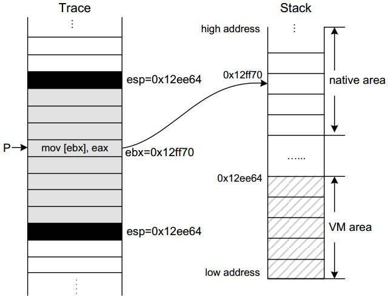
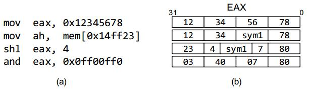
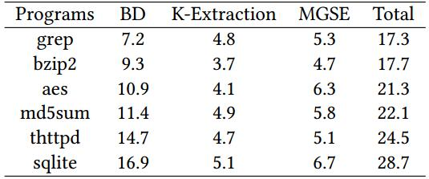

# **论文笔记**

**题目**：VMHunt: A Verifiable Approach to Partially-Virtualized Binary Code Simplification

**出处**：ACM CCS 2018

**作者**：Dongpeng Xu, Jiang Ming, Yu Fu, Dinghao Wu

**单位**：The Pennsylvania State University

**原文**：[https://dl.acm.org/citation.cfm?id=3243827](https://dl.acm.org/ft_gateway.cfm?id=3243827&ftid=2008917&dwn=1&CFID=92023352&CFTOKEN=ee9cc3e7eb5e9455-A59E8674-D112-2C0A-94FA4A1070782335)

**相关材料**：[会议](https://www.sigsac.org/ccs/CCS2018/program/), [GitHub项目地址](https://github.com/s3team/VMHunt)

## **一、背景**

代码虚拟化技术（Code Virtualization）是保护代码的主要技术之一，它把程序的代码（通常是汇编代码）转换成一种新的字节码，运行在定制的虚拟指令集架构ISA（Virtual Instruction Set Architecture）之上，而在运行时，这些字节码被一个内嵌的专用的虚拟机解释执行，在这种专用的定制的虚拟机中，它们的字节码通常是使用一种类似精简指令集（RISC）的方式实现，因此，一条x86上的指令，就会被翻译成一系列的字节码指令，从而导致最终的指令数量急剧增加，使得逆向分析人员很难从这些新的ISA中提取出代码的语义信息来，此外，这里的新的ISA可以随机生成，使得它们的字节码在不同的ISA中完全不一样，从而让静态分析不可行。有了代码虚拟化技术，可以极大的增加软件逆向的难度，从何能够起到很好的代码保护作用。软件的开发者通常可以使用虚拟化技术来保护自己的核心代码，例如，软件的开发者通常使用虚拟化技术保护自己的代码不被破解（unregister version/registrater version），勒索软件的开发者通常使用虚拟化技术来保护密钥的生成过程等，因此，如果有一种方法能够为分析人员分析虚拟化代码提供便利，则可以大大的提高分析人员的工作效率。

## **二、提出的方法以及解决的问题**

虽然代码虚拟化技术对软件的逆向提出了极高的挑战，但是，依然有不少研究人员在研究如何逆向被虚拟化的代码，但是这些研究都存在一个共同的问题，它们都假设这些虚拟化的代码所在的位置是事先知道的（通过手工提前分析出来），然后在这个基础之上再去研究虚拟机（VM）的经典结构，并且很少人对它们的研究结果进行正确性验证（反混淆之后没有对反混淆的结果进行正确性验证）。因此，基于目前的这种现象，作者就开发了一个反混淆工具--VMHunt，用来分析被虚拟化工具所虚拟化的代码，使得软件逆向分析人员能够更加快速的理解被虚拟化的代码的作用。下图左边就是被虚拟化之后的代码片的流程图，右边就是被VMHunt简化之后的流程图。

## **三、技术方法**

由于代码虚拟化是一种基于进程级别的虚拟机技术，并且在进入虚拟机和离开虚拟机的时候存在一个上线文切换（保存或者恢复所有的寄存器的值），因此，基于这样一个事实，VMHunt就可以精确地检测出虚拟化代码所在的范围，然后再对这些代码进行简化、去重等操作，使简化后的代码远远小于未简化的代码，并且容易被人所理解。
代码虚拟化通常通过位操作来混淆变量，因此，为了更好的恢复被混淆的数据，作者开发了一个多粒度的符号执行引擎（Multiple Granularity Symbolic Execution Engine），该引擎对数据的标记最大可以支持32比特，最小可以支持1比特，因此，它可以更精简、更方便的表示所生成的符号表达式。

上图是经典的代码模拟器的结构（例如：x86Virtualizer和Tigress），它是由一个核心的中央派遣函数（Decode-Dispatch-Base）组成的解释器，对于每一条虚拟指令，它都调用一个对应的分发函数（Handler）进行处理，而每一个分发函数又是运行在真实的CPU之上，并且一般情况下，这些分发函数都是已经被高度混淆过的。在图中，第一步到第四步组成了一个虚拟机的核心部分，它由一个大循环组成，包括取字节码，调用字节码对应的处理函数等。这里的处理函数和字节码所对应的语义是相同的，但是由于处理函数已经被高度混淆，因此，直接去分析和理解这些处理函数就变得非常困难，而为了更好的理解这些处理函数，就必须要对它们进行高度的优化和简化。

对于以上的经典结构，已经有很多人对它进行了研究，并且也有一些相应的反混淆工具（例如：Deobfuscator 和 VMAttack等）。此外，由于这种经典的结构使用的是一个中央分发处理函数，因此在执行过程中会由于CPU预取指令预测失败导致非常严重的性能开销。所以，目前商业的混淆器（例如最新版的Code Virtualizer 和 Themida）采用了另一种结构：线索化解释器结构（Threaded Interpretation），这种解释器结构不但可以提高性能，而且还可以增加逆向的难度，它不再采用中央控制的循环处理结构，而是把解码例程（Decode-Dispatch Routine）附加到每一个处理函数（Handler-Function）当中，从而使得目前基于检测大循环结构的反混淆工具失效。更有甚者，Code Virtualizer还专门在虚拟机中附加了一个假的中央循环结构，用来迷惑反混淆工具。

如上图所示，左边是传统的解码-分发结构，中间是大循环，包括取指、解码、分发等过程，右边是线索化的解释流程，可以通过查表的形式来查找目标例程，从而不会因为CPU预测失败而增大性能开销。

如上图所示是VMHunt核心处理流程，右边的上下两个分支表示的是两个不同的虚拟机架构（同一个程序中可以嵌套多种不同架构的虚拟机），斜体部分表示VMHunt的三个核心组成部分，分别是：Virtualized Snippet Boundary Detection、Virtualized Kernel Extraction和Multiple Granularity Symbolic Execution。VMHunt这个工具是基于Trace之上开发的，也就是说，首先需要使用Intel提供的Pin工具对目标程序进行Trace记录，记录程序在运行过程中的每一条执行过的指令，并把当时的上下文和指令地址也记录在Trace文件中。

### **1. 虚拟化代码边界检测**

虚拟化代码边界检测（Virtualized Snippet Boundary Detection）模块，根据Trace记录中的内容，来检测虚拟代码片（Virtualized Snippet）的边界，检测方法是：在真实环境和虚拟环境之间进行切换的时候需要保存上下文和恢复上下文，当然，作者还会根据栈平衡和跳转转移等相关的规则来提高检测的精度，具体情况如下图所示：

### **2. 虚拟化代码核的提取**

上一步得到的结果只是一些边界信息，因此，需要对这些边界之内的代码进行分析，虚拟化代码核的提取（Virtualized Kernel Extraction）模块，根据上一步检测出来的边界结果，使用核提取技术来分析和提取虚拟代码片的Kernel，这里的Kernel指的是：在虚拟化代码片中，能够影响到外部本地执行环境的指令（相对于虚拟机内部环境），例如刚进入虚拟机的时候需要从外部读取参数信息，离开虚拟机的时候需要把执行结果传到外部等，因此，Kernel能够揭示虚拟化代码片的语义信息。具体情况如下图所示，左边黑色部分是两个虚拟代码的边界，两个黑色部分之间就是虚拟化的代码片，右边上半部分是虚拟机外部的栈，下半部分是虚拟机内部的栈，左边的P所指的指令就是该代码片的Kernel的一部分，因为它从虚拟机外部环境中读取参数，它操作的是外部环境中的数据。

### **3. 多粒度符号执行引擎**

为了提取出虚拟化代码的语义信息，需要通过符号执行引擎来获得虚拟核的符号表达式，并且，为了验证所生产的符号表达式的正确性，还需要和原始代码所对应的符号表达式进行对比，并且使用一个理论证明工具[STP](https://link.springer.com/chapter/10.1007/978-3-540-73368-3_52)来验证，这也是目前的研究工作中很少有实现的一个功能。然和，现代的虚拟化代码中通常包含有大量的位操作，而且这些位操作还不一定是8位的整数倍，还有可能是9位等这些特殊的位数，因此，为了更好的处理不同的位操作方式，作者开发了一个多粒度符号执行引擎（Multiple Granularity Symbolic Execution）模块，该引擎的优点是兼顾性能与精度，相比于细粒度（以1比特为单位来标记数据）的符号执行引擎，性能更好，相比于粗粒度（例如以1字节为单位来标记数据）的符号执行引擎，精度更高。多粒度符号执行引擎的优点如下图所示，刚开始的时候EAX寄存器中的值都是具体的值，第二条指令从内存中读取一块数据到寄存器AH中，从而导致AH变为符号值，第三条志林把EAX寄存器左移4比特，从而导致符号值也会左移4比特，最后一条指令执行AND操作，事实上此时的EAX中已经没有了符号值，都是具体的值，但是如果采用粗粒度符号执行引擎的话，此时的EAX都变成了一个符号值，而如果使用多粒度符号执行引擎的话，此时的EAX就可以用一个具体的值来表示，从而可以简化执行过程中的符号表达式。

## **四、实验评估**

作者对VMHunt进行了有效性（effectiveness）和性能开销（performance）进行了评估，实验环境是：Core I7-3770， 8G内存，Ubuntu 14.04。使用的测试集都是开源的有代表性的程序：grep-2.21、bzip2-1.0.6、md5sum-8.24、AES in OpenSSL-1.1.0-pre3、thttpd-2.26和sqlite-2.26。使用的混淆工具都是当时最新版的代码虚拟化工具（2018年5月9号最新的专业版本）：Code Virtualizer、Themida、VMProtect和EXEcryptor。

### **1. 有效性（effectiveness）**

对6个开源工具使用CodeVirtualizer虚拟化之后使用VMHunt测试的结果如上表所示，第一列是被测试的目标程序的名称，T表示Trace记录的行数，S1和S2表示虚拟化代码片在Trace记录中的行数，K1和K2表示从S1和S2中提取并简化之后的核（Kernel）的行数，从表中可以看出，虚拟化代码在整个Trace中所占的比例大概在10%左右，而简化之后的虚拟化代码的Kernel只占整个Trace的0.1%左右，相差4个数量级，可见，VMHunt可以大大的减少被分析的代码数量。

此外，为了验证多粒度符号执行引擎的准确性，作者把MGSE（Multiple Granularity Symbolic Execution）对Kernel所产生的符号表达式和MGSE对未被虚拟化的代码所产生的符号表达式进行对比，通过STP工具检查之后发现，VMHunt所生成的符号表达式所代表的语义信息和原始程序中的语义信息是一致的。

为了对比单粒度的符号执行引擎和多粒度的符号执行引擎，作者把MGSE分别和基于1比特的符号执行引擎、基于8比特的符号执行引擎进行了性能对比，在VMHunt所提取出来的VirtualKernel上，分别让这三个符号执行引擎运行，所得结果如下表所示，byte、bit和MG分别表示基于8比特、1比特和多粒度的符号执行引擎，Metrics列中的size、var#和time分别表示符号执行引擎最后生成的符号表达式所占的行数、引擎所生成的变量的数量和引擎所使用的时间（秒），“-”表示超过30分钟还没执行完。从表中可以看出，不管是代码行数和时间开销，MG所对应的值最小，bit所对应的值最大，byte所对应的值居中，从时间开销方面看，MG大约比byte快10倍，比bit快20倍。并且VMHunt可以生成更加具体和更加高效的符号表达式，特别是对于比特操作方面。

对于虚拟机多层嵌套的情况，作者在文中测试了两层嵌套的情况，VMHunt也能够正确的处理（先处理内层嵌套，再处理外层嵌套）。

作者从网上（VirusTools和其它论坛等）收集了10个恶意软件样本，这些样本都是被工具虚拟化过的，并使用VMHunt对它们进行测试，测试结果如下表所示，T表示生成的Trace记录的长度（行），S表示虚拟化代码片的长度（行），K表示提取出来的虚拟化核的长度（行），S/W表示虚拟化代码片所占的百分比，K/W表示虚拟核所在的万分比。从表中可以看出，在10个样本中，所有样本的虚拟化代码片都被VMHunt检测出来，并且最终结果都被简化了将近4个数量级。

对于没有被虚拟化的程序，VMHunt的边界检测模块可能也会出现误报，例如某些函数调用可能就刚好用到所有的寄存器，因此就会把所有的寄存器都压入栈中，执行完该函数之后再把所有的寄存器弹出，这种情况会被VMH的边界检测模块检测到，但是在后面的虚拟化核模块中会过滤掉这种误报，因为如果代码没有被虚拟化，则在提取虚拟核之后的结果和原始结果（代码行数）在数量级上不会有差别，而如果是虚拟化之后的代码，被提取出虚拟核之后，代码的数量级一般不在同一个数量级（否则虚拟核的提取就没有意义了），所以，作者在这里设定一个阈值（虚拟核代码小于原始代码的90% 并且小于1万行代码），如果超过这个阈值则过滤掉。如下图所示是VMHunt在grep程序上的执行结果，第4四和第7个代码片是被虚拟化过的，其它的都是没有被虚拟化的。

### **2. 性能开销（performance）**

VMHunt主要由记录（Trace Logging）和离线分析（Offline Analysis）两个阶段，而记录阶段的性能开销大概在是原来的5倍，离线分析大概在20分钟左右。如下表所示是对6个程序的分析结果，DB表示边界检测（Boundary Detection），K-Extration表示虚拟核的提取，MGSE表示多粒度的符号执行引擎，时间以分钟为单位。

## **五、优缺点**

### **优点：**

- VMHunt的主要优点之一是：它不需要提前知道被虚拟化的代码所在的范围，因此，也不需要手工去寻找虚拟化代码所在的位置，因为VMHunt可以自动的去寻找虚拟化代码所在的位置。
- VMHunt的另一个主要的优点是：它所生成的结果可以被证实，也就是可以验证结果的有效性，确保反混淆的结果的功能和原始程序的功能在语义上保持一致，这是以前很多研究工作所不能做到的。
- 使用多粒度的符号执行引擎（Multiple Granularity Symbolic Execution），可以大大的减少最后生成的符号表达式的大小，并且可以去掉很多冗余的符号变量，使得最后生成的符号表达式更加精简。

### **缺点：**

- VMHunt的一个主要的缺点就是它还不支持64位的程序，目前只能支持32位的程序。
- VMHunt只支持部分虚拟化的程序，而如果作者对整个程序进行虚拟化，则VMHunt无法对其进行分析。
- VMHunt是基于Trace的，如果在生成Trace的时候有些分支没有不执行到（这是正常情况），则VMHunt也可能会存在漏报的情况。

## **六、个人观点**

在这篇文中，作者描述了VMHunt这个基于Trace的虚拟化代码简化工具，工具包括几个组成部分，首先是要使用Intel的Pin工具来生成一份运行时记录（把它叫做Trace），而后面所有的工作都是基于这个Trace，有了Trace之后，就可以使用边界检测模块来检测Trace中是否有被虚拟化工具混淆过的代码，如果有，则记录它们所在的起始点和结束点，并把它叫做Snippet，边界检测工具检测完之后，就开始执行虚拟核提取模块，把生成的Snippet进行简化，使得简化之后的代码数量远远小于未简化的代码数量，并把简化之后的Snippet叫做虚拟核（VirtualKernel），最后再使用一个多粒度符号执行引擎对虚拟核进行符号执行，生成控制流图和最终的符号表达式，经过STP工具的验证，最终生成的符号表达式的语义和原始程序的语义信息一致，而这里的验证过程是前人很少做过的工作。

对于VMHunt这个工具，我觉得它的一个亮点是它可以自动化的搜索虚拟化代码片，另一个亮点是它的虚拟核提取技术可以极大的精简虚拟化代码的数量，它可以对虚拟化的代码进行提取、简化，使得简化之后的结果远远小于原始代码。但是对于作者所说的语义验证模块，他使用的是STP这个工具来验证，但是文中却没有给出验证的结果，所以看完文章之后我也不知道作者是怎么判断简化的虚拟核的语义和原始代码的语义相同。虽然文中作者对一个恶意软件（tears）进行了详细的分析，并且还分析了该恶意软件的密钥生成过程，但我对他的符号执行引擎的输出结果还不是很明白，或者说不是很理解，而当我自己去用作者的工具来跑的时候（VMHunt有四个可执行文件:instracelog.so/instracelog.dll、vmextract、slicer和mgse），却发现程序（mgse）总是运行到一半就崩溃（CoreDump了），或者是没有任何的输出结果（vmextract）,或者是只输出了恢复寄存器的位置，而没有输出保存寄存器的位置，这就是我感觉到很奇怪，可能是我使用的方式不对，因为我使用的Trace是在Windows2003 x86服务器上跑出来的，并且使用的混淆工具也是在Windows 2003 x86上混淆程序的。从文章中看，VMHunt的效果还是挺不错的，但是从我自己的使用体验来看，好像还存在很多问题。我试了CodeVirtualizer和VMProtect，并且在Window 32位系统上混淆代码和跑Trace，在Ubuntu 16.04 x86上跑VMHunt，效果不是很理想。

