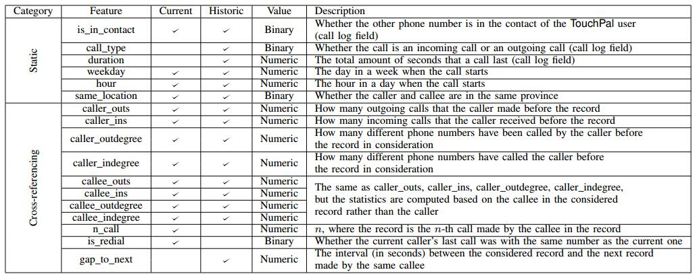

# **论文笔记**

**题目**：A Machine Learning Approach To Prevent Malicious Calls Over Telephony Networks

**出处**：IEEE Symposium on Security and Privacy 2018

**作者**：Huichen Li (Shanghai Jiao Tong University), Xiaojun Xu (Shanghai Jiao Tong University), Chang Liu (University of California, Berkeley), Teng Ren (TouchPal Inc.), Kun Wu (TouchPal Inc.), Xuezhi Cao (Shanghai Jiao Tong University), Weinan Zhang (Shanghai Jiao Tong University), Yong Yu (Shanghai Jiao Tong University), Dawn Song (University of California, Berkeley)

**单位**：Shanghai Jiao Tong University, University of California, Berkeley, TouchPal Inc.

**原文**：[https://arxiv.org/pdf/1804.02566.pdf](https://arxiv.org/pdf/1804.02566.pdf)

**相关材料**：[Video](https://www.youtube.com/watch?reload=9&v=97TrCZ4egUc&feature=youtu.be), 
[会议](https://www.ieee-security.org/TC/SP2018/program-papers.html)

## **一、背景**

&ensp;&ensp;&ensp;&ensp;骚扰电话与咋骗电话一直以来都是人们很厌恶的事情，当然，目前的市场上也存在很多的防骚扰的软件，比如触宝电话（TouchPal）等，但也很难达到高效的检测恶意电话。传统的防骚扰措施一般都需要有服务端（telephony networks’ infrastructures）的支持，需要从服务端获取相应的信息才能检测恶意电话，但这对于普通的终端用户来说，一般是无法直接访问到服务端的信息的，因此，对于检测恶意电话的第一个重大的挑战就是如何去获取这些必要的信息。本文的一个主要的贡献就是收集了大量的必要信息。这些信息的来源就是从触宝电话中获取，作者通过跟触宝电话方合作（触宝电话拥有大量的客户），在触宝电话的基础上开发了一套接口，让触宝用户可以直接标记一个电话是否为恶意电话，从而收集了大量的有用信息，这些信息包含了2016年10月到12月这三个月以来的所有数据（90亿条记录），这些数据就是这篇论文的基石。

## **二、提出的方法以及解决的问题**

&ensp;&ensp;&ensp;&ensp;本文在不依赖于任何电信网络基础设施（telephony networks’ infrastructures）的前提下，第一个提出使用机器学习的方法来防御骚扰电话，并且取得很好的效果。本文构造了一套有效的特征，可以从这些特征当中很好的识别出哪些是恶意电话，哪些是良性电话。通过这些特征，可以让机器学习算法取得很高的精确度，可以减少90%的未被拦截的恶意电话，并且对于良性电话，能达到99.99%的识别精确度。

## **三、技术方法**

&ensp;&ensp;&ensp;&ensp;目前，触宝使用的防止恶意电话的措施是基于名誉的黑名单列表（reputation-based black-listing），这种方法的工作原理是：预设一个阈值T，当某个电话号码被T个用户标记为恶意电话的时候，当下次有用户再看到这个电话号码打进来的时候，触宝APP就会自动识别该电话号码为恶意电话，并屏蔽该号码。这种方法的不足之处就是需要有T个用户标记该电话为恶意电话之后，触宝才把这个电话号码当做恶意电话。而本文提出的方法是基于机器学习的方法来检测恶意电话，首先，作者根据已经收集到的数据（触宝电话记录下来的数据）设计了29个特征，如下表所示：

&ensp;&ensp;&ensp;&ensp;这里的 Current 和 History 两列表示不同的特征，如果不打勾则表示没有这个特征。

&ensp;&ensp;&ensp;&ensp;作者在处理数据的之前做了如下假设：

- 如果打进来的电话是触宝用户的电话号码，则默认这个号码不是恶意电话，因为作者觉得触宝用户不可能是恶意用户。
- 如果触宝用户不同意触宝使用条款的话，则不使用该用户产生的数据，因为不同意触宝使用条款，触宝电话就无法获取用户的通话记录，也就使得触宝电话无法正常收集数据。

&ensp;&ensp;&ensp;&ensp;基于以上的假设，作者就分别使用了6种机器学习模型来处理这些数据，这6中机器学习模型分别为：vanilla neural network(NN)、SVM、logistic regression(LR)、LSTM-based RNN model(RNN)、the random forest models from sklearn(RF) 和 the random forest models from XGBoost(XGBoost)，期望的目标有两个：

- 使得尽可能多的良性电话不被预测为恶性电话。
- 在最少的通话次数中识别出某个电话号码是否为恶意电话的号码。

&ensp;&ensp;&ensp;&ensp;通过对这6种机器模型的比较，最终选择了RF作为最好的预测模型。

## **四、实验评估**

&ensp;&ensp;&ensp;&ensp;作者选择了6中机器学习模型来训练和预测已经收集好的数据，并提出两个度量值：AUC（Area Under Curve，被定义为ROC曲线下的面积） 和 AFP（Average First Prediction，被定义为一个电话号码第一次被预测为恶意号码时，它已经进行过多少次通话）。由于作者所搜集的数据具有高度的不对称性，良性电话的数量远远大于恶意电话的数量，因此，对于一个给定的时间段和给定的省份的数据，训练数据的组成是：选择在该时间段和该省份内的所有恶意电话记录，再加上等量的良性电话记录构成一组训练数据集，在每一次的实验都进行五次这样的选样本方式进行训练，每次选样的恶意电话记录都一样，只是良性电话记录不一样，并取五次的平均值作为最后的结果。测试数据集也要进行同样的选样本方式。作者评估了以下三个方面：

### **1. 对时间的泛化能力**

&ensp;&ensp;&ensp;&ensp;作者希望从当前的数据训练出来的模型也能适用于将来的数据，但是文中并没有提到将来的数据。对于6种机器学习模型，它们的AUC分数都在0.985以上，最好的是RF模型，AUC分数为0.9978以上。对于XGBoost、NN 和 RF 三种机器学习模型，它们的AFP值都在5.5之下，也就是平均在5.5个通话记录以下，就能够判断出某个电话号码是否是恶意电话号码，而对于另外三种机器学习模型，它们的AFP值都接近于阈值 M。

### **2. 对地区的泛化能力**

&ensp;&ensp;&ensp;&ensp;作者希望从当前省份的数据训练出来的模型也能适用于别的省份的数据，所得结果与对时间的泛化能力相似，结论是：对一个省份（通常是具有较多通话记录的省份）的数据训练得到的模型同样适用于别的省份。

### **3. 运行时性能评估**

&ensp;&ensp;&ensp;&ensp;作者使用的工具平台是：Intel i7-6900K CPU with 15 cores running at 3.20GHz and 96GB memory，在实验中，为了消除由于IO导致的延迟，作者把所有的数据都提前载入内存，并对每一次的实验做5次，取平均值作为最后的结果。对于6中机器学习模型的运行时性能比较如下图所示：

&ensp;&ensp;&ensp;&ensp;从上图可知，Random Forest Models 具有最高的运行时延迟，从 20ms （XGBoost） 到 100ms (RF) 左右，这是由于模型的复杂性决定的（随机森林模型包含100棵决策树，并且每一棵决策树有3层），而对于其它的模型，延迟都在 2ms 以下，

### **4. 特征消减**

&ensp;&ensp;&ensp;&ensp;此外，作者通过随机森林算法给所有的特征的使用频率按从高到低排序，经过测试发现，只使用 cross-referencing 特征，就可以在不牺牲精确性的同时，实现很好的效果，接近于使用全部特征的情况。

## **五、优缺点**

### **优点：**

- 跟触宝电话进行合作，从而能够获取到大量的基础数据，这是这篇文章的基础，也就是作者的优势所在。
- 使用多个机器学习模型来训练数据，并比较各个模型的效果，最后使用随机森林模型（random forest model）作为最好的预测模型，使得文章所取得的结果更加精确。
- 由于良性电话的数量远远大于恶意电话的数量，因此，作者巧妙的构造训练集和测试集的组成成分，使之更加适用于训练算法。

### **缺点：**

- 正如上文所提到的，作者默认触宝用户的电话不可能是恶意电话，这就存在很大的问题，如果恶意电话的作者使用了触宝电话，也成为触宝的一个用户，那么，作者的检测方法就失效了。
- 在作者的这个模型中，无法有效的处理电话欺骗情形。
- 这个模型无法区分推销类电话与咋骗类电话。

## **六、个人观点**

&ensp;&ensp;&ensp;&ensp;文章的核心思想就是使用机器学习的方法去预测恶意电话，并设计了29个特征去 Feed 给机器学习模型，同时，为了达到更好的预测精度，作者使用了6中不同的机器学习算法，筛选出预测精度最高的算法（RF）,使之可以减少90%的恶意电话，并以99.99%的精度识别良性电话。文章的基石是从触宝电话中取得的90亿条记录，让6个机器学习算法在这些数据上进行训练与测试，以获得最佳的预测结果。 但是，由于数据的高度不对称性，良性数据的量远远大于恶性数据的量，所以对机器学习算法产生一定的影响，但是作者巧妙的对数据进行了划分，使得这些数据对算法的影响尽可能的小，从而达到最优效果。从文中我们也可以看出，作者虽然不需要去运营商（比如移动运营商、联通运营商等）那里获取数据，但是需要从触宝那里获取数据，因此，需要跟触宝进行合作，以获得它们那里的数据。与此同时，我们还可以知道，作者的模型还是存在一定的问题的，例如，作者是盲目相信触宝用户的，凡是触宝用户的电话号码，默认都一定是良性的，这也就是一个很大的漏洞，因此，还有待改进。整体来说，作者是第一个提出了使用机器学习的方法来预测恶意电话，这比起单纯使用黑名单的方式防止恶意电话还是取得很大的进展的。
