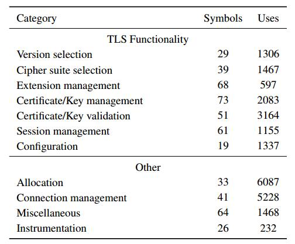
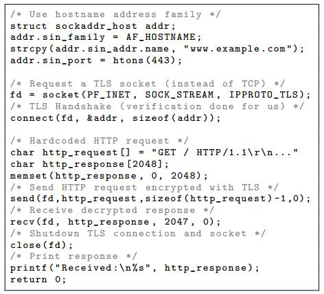
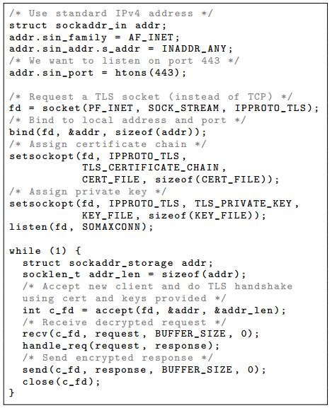
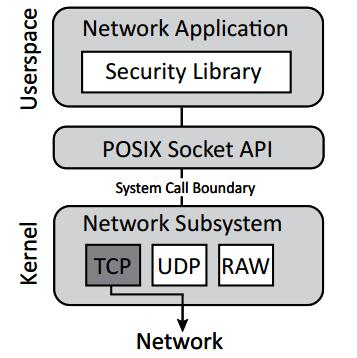
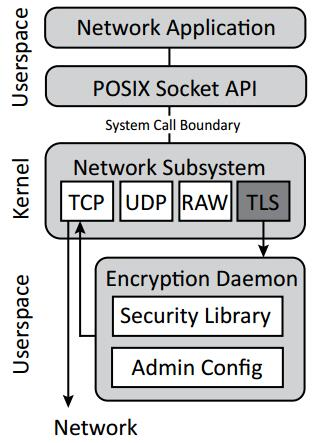
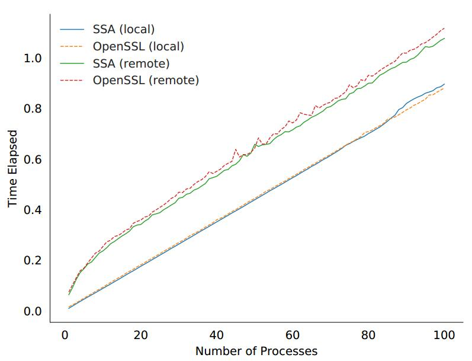

# **论文笔记**

**题目**：The Secure Socket API: TLS as an Operating System Service

**出处**：USENIX Security 2018

**作者**：Mark O'Neill, Scott Heidbrink, Jordan Whitehead, Tanner Perdue, Luke Dickinson, Torstein Collett, Nick Bonner, Kent Seamons, and Daniel Zappala

**单位**：Brigham Young University

**原文**：[https://www.usenix.org/system/files/conference/usenixsecurity18/sec18-o_neill.pdf](https://www.usenix.org/system/files/conference/usenixsecurity18/sec18-o_neill.pdf)

**相关材料**：[会议](https://www.usenix.org/conference/usenixsecurity18/presentation/oneill), [Slides](https://www.usenix.org/sites/default/files/conference/protected-files/security18_slides_oneill.pdf)

## **一、背景**

&ensp;&ensp;&ensp;&ensp;Transport Layer Security (TLS) 是被广泛使用的一种安全传输协议，有了它，可以使得互联网上的任意两个终端用户进行安全的数据传输，极大的促进互联网的发展。但是，它是一把双刃剑，正确的使用 TLS 传输协议，可以使得两个用户之间的通信安全、可靠、保密，如果使用不正确，将会使得两个用户之间的数据传输不可靠、甚至被窃听等。像 OpenSSL 和 GnuTLS 等这样的类库，具有十分丰富的接口和功能，但是它们具有较高的复杂性，因此，开发者肯能会经常会出现误用的情况，使得它们经常被程序员所诟病。因此作者提出了 Secure Socket API (SSA)。

## **二、提出的方法以及解决的问题**

&ensp;&ensp;&ensp;&ensp;基于上述的背景：TLS 的高复杂性，使得开发员很难上手使用，甚至导致误用等，作者提出了一个简化 TLS 的方法：SSA，它变成了系统的一项服务，所有应用程序都可以使用，并且系统管理员可以控制该服务，对它可以进行配置和更新等操作。有了 SSA，使得开发员只需要熟悉 socket API，改变 socket 函数的一个参数，就可以轻易的使用 TLS 协议，并且使得原来使用 OpenSSL 库进行安全网络传输的应用程序，经过简单的修改，也能使用 SSA。在有些情况下，只需要修改一行代码，就能使得原来的应用程序移植到 SSA 上。

## **三、技术方法**

&ensp;&ensp;&ensp;&ensp;作者通过分析 410 个使用 C/C++ 实现的、并且使用 libssl 库的 Linux 安装包，并且对 504 个 libssl 导出的、开发者能用到的 API 符号进行定性的分析，分析结果表明，这些 API 可以分为两类：一类是用来指定 TLS 协议的行为的 API（例如：指定 TLS 协议的版本信息等）；另一类是于 OpenSSL 的实现相关的 API（例如：分配和释放 OpenSSL 相关结构体等）。

&ensp;&ensp;&ensp;&ensp;&ensp;&ensp;&ensp;&ensp;&ensp;&ensp;&ensp;&ensp;&ensp;&ensp;&ensp;&ensp;表1： 504 个 OpenSSL 中 libssl 的 API 分类

&ensp;&ensp;&ensp;&ensp;“Uses” 这一列表明该类别的 API 在 410 个安装包中的使用情况，经过分析发现，在这 504 个 API 中，有 170 个 API 是没有被这 410 个安装包使用过的。

&ensp;&ensp;&ensp;&ensp;有了这些分析结果，作者就从中吸取了经验和教训，设计出了 Secure Socket API（SSA），SSA 可以自动的管理每一个 TLS 连接，包括会话管理、密码套件选择、扩展管理等。应用程序可以直接使用 send 和 receive 等标准的网络接口函数，进行网络通信，只要在穿件 socket 的时候设置好一个参数，应用程序就可以透明地使用 TLS 进行通信，而 SSA 会在后台自动的管理 TLS 通信过程，进行解密与解密数据等操作，并且所有的这些过程都会受到系统的配置策略所控制，因此，系统管理员可以对 TLS 进行统一配置和管理。简单的客户端和服务端使用例子如图1和图2所示。

&ensp;&ensp;&ensp;&ensp;&ensp;&ensp;&ensp;&ensp;&ensp;&ensp;&ensp;&ensp;&ensp;&ensp;&ensp;&ensp;&ensp;&ensp;图1： 简单的 HTTPS 客户端

&ensp;&ensp;&ensp;&ensp;&ensp;&ensp;&ensp;&ensp;&ensp;&ensp;&ensp;&ensp;&ensp;&ensp;&ensp;&ensp;&ensp;&ensp;&ensp;图2： 简单的 HTTPS 服务端

&ensp;&ensp;&ensp;&ensp;从图1中我们可以看到，使用 TLS 协议的客户端应用程序，只有在创建 socket 的时候，第三个参数使用的是 IPPROTO_TLS， 其它的代码与普通的网络客户端应用程序一样。从图2中也可以看到，使用 TLS 协议的服务端应用程序，与普通的服务端应用程序相比较，只有三个地方不一样，分别是创建 socket、设置服务器端的证书信息、设置服务器端的密钥信息。所以，只要是熟悉标准 socket 通信的开发者，都很容易上手 SSA，简单、方便是 SSA 的主要优点之一。

&ensp;&ensp;&ensp;&ensp;SSA 作为一项服务而存在，它不依赖于任何应用程序，它使用 OpenSSL 在后台为网络应用程序提供加密解密等服务，图3和图4分别是：未使用 SSA 之前的网络应用程序数据流图和使用 SSA 之后的网络应用程序数据流图。使用 SSA 之后，管理员可以对整个系统中的网络应用程序进行全局统一的配置，也可以有针对性的对单独的应用程序进行配置。

&ensp;&ensp;&ensp;&ensp;图3： 未使用 SSA 之前的网络应用程序数据流图

&ensp;&ensp;&ensp;&ensp;图4： 使用 SSA 之后的网络应用程序数据流图

## **四、实验评估**

&ensp;&ensp;&ensp;&ensp;作者的测试环境为： 6 核超线程 CPU, 16 GB 内存, Fedora 26 操作系统。

&ensp;&ensp;&ensp;&ensp;作者使用两个应用程序进行测试，一个使用 SSA， 另一个使用 OpenSSL，通过 HTTPS，使用相同的参数下载 1 MB 大小的文件，并同时创建多个应用程序实例，改变并发执行的进程数量，记录它们接收完这个文件所使用的时间。为了对比，作者还进行了本地测试和远程测试，分别把服务器安装在本地和远程。测试结果如图5所示。

&ensp;&ensp;&ensp;&ensp;&ensp;&ensp;&ensp;&ensp;&ensp;&ensp;&ensp;&ensp;&ensp;&ensp;&ensp;&ensp;&ensp;&ensp;&ensp;&ensp;&ensp;&ensp;&ensp;&ensp;&ensp;&ensp;&ensp;&ensp;&ensp;&ensp;图5： 性能测试图

&ensp;&ensp;&ensp;&ensp;在图5中，下面两条线是进行本地测试的结果，上面两条线是进行远程测试的结果，虚线是使用 OpenSSL 的图，实线是使用 SSA 的图。从图中可以看出，不管是进行本地测试还是进行远程测试，它们的测试结果相差很小。对于本地测试，它们的曲线几乎重叠，而对于远程测试，使用 SSA 对于每个进程而言，所带来的延迟大约为 0.1毫秒到0.4毫秒之间，车别也不是很大。

## **五、优缺点**

### **优点：**

- 最大的优点就是简单，容易上手，只要是熟悉网络应用程序的开发者，都可以很容易的使用 SSA 开发出具有安全通信协议的网络应用程序。
- 相对于使用 OpenSSL 开发的网络应用程序而言，使用 SSA 很大的减少了程序的代码量，从而使得开发人员更加专注于开发特定的功能模块，而不必花费太多的时间在使用复杂的 OpenSSL 上面。
- 安全性进一步提升，系统管理员可以对系统上的应用程序进行统一的配置和管理，方便升级，安全性更高。
- 对于部分已经使用 OpenSSL 的应用程序，只需要修改很少一部分的代码就可以直接移植到 SSA 上。

### **缺点：**

- 移植老的应用程序到 SSA 上需要花费一定的时间，并且 SSA 还未经过广泛的测试，不确定它是否存在其它的缺陷或者是 bug。
- 由于 SSA 作为一种服务而存在，如果它存在漏洞，那么，整个系统中的所有使用 SSA 的应用程序都会受到影响。
- SSA 的另一个限制是： 它本身不支持异步回调函数，这对于部分应用程序而言，可能会达不到应用程序的需求。

## **六、个人观点**

&ensp;&ensp;&ensp;&ensp;总体来说，作者通过使用工具静态分析 OpenSSL 的 libssl 库，并且手工的去加以辅助分析，从中分析出 OpenSSL 中的 API 使用情况，并针对这种情况提出了简化方法：SSA，使得网络开发人员摆脱了复杂的 OpenSSL 和 GnuTLS 等类库的困扰，可以很容的实现具有安全通信的网络应用程序，这对于使用 OpenSSL 开发网络应用程序的开发者来说是一个非常好的预兆。假设 SSA 真的被广泛的采纳，那么，我们就可以不用关心 OpenSSL 里面的复杂 API，而是直接使用 socket 通信并通过设置一下参数（SSA 兼容 POSIX socket API），就可以实现安全通信了，这无疑又是网络界安全通信的重大进步。
