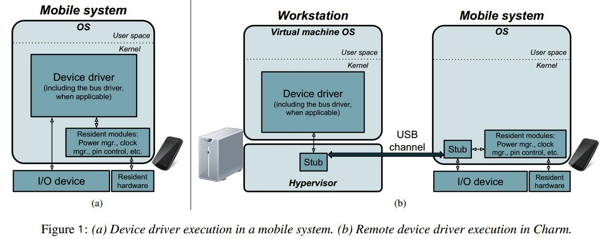
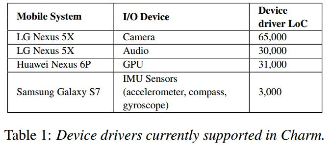
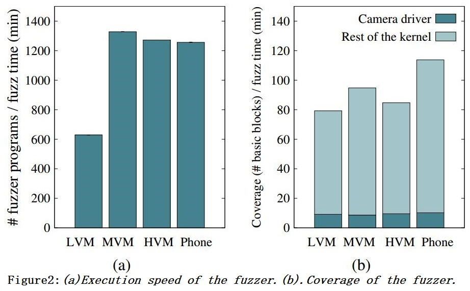
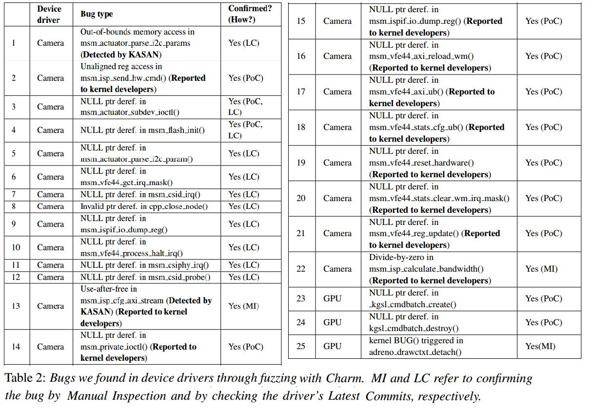

# **论文笔记**

**题目**：Charm: Facilitating Dynamic Analysis of Device Drivers of Mobile Systems

**出处**：USENIX Security 2018

**作者**：Seyed Mohammadjavad Seyed Talebi and Hamid Tavakoli,  Hang Zhang and Zheng Zhang, Ardalan Amiri Sani, Zhiyun Qian

**单位**：UC Irvine (加利福尼亚州大学欧文分校), UC Riverside (加利福尼亚大学河滨分校)

**原文**：[https://www.usenix.org/system/files/conference/usenixsecurity18/sec18-talebi.pdf](https://www.usenix.org/system/files/conference/usenixsecurity18/sec18-talebi.pdf)

**相关材料**：[Conference](https://www.usenix.org/conference/usenixsecurity18), [Slides](https://www.usenix.org/sites/default/files/conference/protected-files/security18_slides_talebi.pdf), [Audio](https://2459d6dc103cb5933875-c0245c5c937c5dedcca3f1764ecc9b2f.ssl.cf2.rackcdn.com/sec18/talebi.mp3), [HomePage](https://www.ics.uci.edu/~sseyedta/index.html), [SourceCode](https://trusslab.github.io/charm/)

## **一、背景**

据报道，截止2015年，已经存在超过 1000 家安卓设备厂商，并且有超过 24000 种不同的安卓设备。随着人们对手机的需求不断增加，手机的功能变得越来越强大，手机所支持的特性也变得越来越多。例如，有些手机厂商追求越来越高清的拍照效果（Camera），而有些手机厂商则追求越来越来越灵敏的指纹识别（Fingerprint）等等。这些不同的特性都需要不同设备驱动程序来支持。因此，在手机端呈现出各种缤纷复杂设备驱动程序，而这些众多的驱动程序，就不可避免的会带来各种 Bug。因此，如何有效的寻找设备驱动程序中的Bug变成一项亟待解决的问题。在桌面端，寻找程序的 Bug 的框架比较成熟，一般来说有三种主要的方式：静态分析（如符号执行）、动态分析（如 GDB 调试）和 Fuzz。第一种方式不需要运行目标程序，因此，也可以适用于手机上的设备驱动程序，但是缺点就是误报率太高，而后两种方式难以对手机上的设备驱动程序实施，因此，如果能够使得后两种方式也能很容易的实施于手机上的设备驱动程序，将可以极大的改善手机上的设备驱动程序的健壮性，使得手机的新特性能够给用户带来更好的体验效果。

## **二、提出的方法以及解决的问题**

基于上述背景，作者在本篇文章中就提出了一种新的解决方案：Charm -- 远程执行设备驱动程序（Remote Device Driver Execution），既把目标设备驱动程序从手机中剥离出来，运行在工作站的虚拟机上（Workstation Virtual Machine），而不是运行在手机设备上，并且使用一根 USB 数据线来解决设备驱动程序和真实 IO 设备之间的通信问题。这样做就解决了上述提到的问题：动态分析和 Fuzz 难以实施于手机上的设备驱动程序，从而有效的促进了对手机设备上的驱动程序的动态分析技术。

## **三、技术方法**

Charm 的总体设计结构如图 1 所示，在图中，（a）表示没有 Charm 之前的正常执行流程图，在一个手机移动设备中，分为上下两层，上层是操作系统，下层是 IO 设备和其它的硬件。在操作系统中有用户层和内核层，而设备驱动程序就运行在内核层当中，它不但需要直接和 IO 设备打交道，还需要和系统中的其它内核模块（例如总线驱动模块、电源管理模块、时钟管理模块和 Pin 脚管理模块等）打交道。因此，如何把设备驱动程序从移动系统的内核中剥离出来，让它运行在工作站中的虚拟机中，成为了本文要解决的主要问题。

而图中的（b）子图便是该问题的解决方案，在工作站的 Hypervisor 之上安装一个虚拟机，把手机系统中的设备驱动程序直接搬到该虚拟机中运行，然后把手机系统端对应的设备驱动程序禁用掉，并在 Hypervisor 和手机系统内核中各安装一个 Stub 小模块，通过一根定制的 USB 数据线来连接二者，进行数据转发和接收。在工作站的 Hypervisor 中安装 Stub，用来接管虚拟机中的设备驱动程序的 IO 请求以及对手机系统中的其它模块的调用（通过远程调用 RPC 实现），然后把 IO 请求和模块调用通过 USB 数据线转发到真实手机设备中。在手机设备中，通过 Stub 模块把收到的 IO 请求转发给真实的 IO 设备中，把模块调用也重定向到对应的模块中，并把执行结果通过 USB 数据线再返回去，来自手机设备中的 IO 中断信息最后也会被反馈到虚拟机中的设备驱动程序中，这就使得二者能够有效的结合并正常工作。

- **技术细节1**：如何把一个运行在 ARM 上的设备驱动程序运行在一个基于 x86 的虚拟机中？

  作者直接把目标驱动程序编译为基于 x86 的驱动程序，但是由于 ARM 和 x86 的指令集架构不一样，因此，编译为 x86 上的驱动程序是否会对设备行为造成影响，是否会在检测过程中出现误报（False Positive）？ 作者的解释是：在目前的测试过程中，还没有遇到一个被确认的误报（Confirmed False Positive）Bug，原因是因为设备驱动程序几乎是完全使用 C 语言实现的，它们所产生的 Bug 基本上来自于源代码，而与编译的目标架构（ISA）关系不大。

- **技术细节2**：Charm 为什么不使用基于 ARM 的虚拟机而使用一个基于 x86 的虚拟机？

  在原始版本的 Charm 中，作者曾尝试过使用 QEMU ARM 虚拟机，把 Charm 完全实现在 QEMU 当中，但是由于虚拟机是运行在一台基于 x86 的工作站之上，因此就需要把 ARM 指令翻译到 x86 指令来执行，但是指令翻译带来很大的性能开销，以至于运行在虚拟机中的设备驱动程序频繁的触发**超时错误**。因此，使用一个本地执行（Native Execution）环境来执行目标设备驱动程序变得非常有必要，作者最后选择把 Charm 实现在一个硬件虚拟化（Hardware-Virtualized）的 x86 虚拟机（KVM）上。

- **技术细节3**：由于系统中使用了两个 Stub 小模块和一根 USB 数据线，因此会给 IO 以及模块调用带来一定的延迟，而 IO 操作是对时间比较敏感的，因此，如何解决延迟问题？

  由于设备驱动程序和 IO 设备之间的交互是对时间比较敏感的，因此，如果二者之间的通信时间控制不好，就有可能会给设备驱动程序和 IO 设备带来大量的延迟问题，因此，作者使用一个定制的 USB 通道来实现二者的通信，减少通信延迟。该 USB 通道在手机端和虚拟机端都在内核中实现（使用两个 Stub 程序），使得通信过程中无需多次跨越用户层/内核层，导致过高的延迟。

- **技术细节4**：如何决定哪些模块需要移到虚拟机中运行，哪些模块需要留在手机系统中运行？

  由于需要在手机端支持 USB 通道，而电源管理模块、时钟管理模块又是支持 USB 通道的基础模块，因此，这些模块是不能被移到虚拟机中运行的。此外，因为还需要保证手机能够正常启动，而 Pin 脚管理模块、GPIO 等又是手机启动所不可缺少的，因此，这些模块也不能被移到虚拟机中，作者把这些不能被移到虚拟机中的模块叫做**持久性模块**（Resident Module）。

### **移植步骤**：

（1）**把目标设备驱动程序的源代码复制到 Charm 虚拟机中**。并且尽可能的使得 Charm 虚拟机所使用的内核版本和手机系统中的内核版本一致。由于体系结构（ISA）不一样，不可避免的会有一些常数常量或者 API 不一致，因此，作者的建议是尽量少修改目标设备驱动程序，而是让虚拟机内核支持 ARM 所特有的常数和 API 接口（修改虚拟机内核）。

（2）**在虚拟机中运行目标驱动程序**。由于驱动程序需要 IO 操作，因此，需要把驱动程序所需要的对应的 IO 设备的相关信息（Device Tree Entries）移动到虚拟机中，使得驱动程序能够检测到。此外， IO 设备所依赖的项也需要移到虚拟机中（例如 Bus Entry）。

（3）**配置 Charm**， 使得驱动程序的 IO 操作以及模块调用（RPC）能够被转发到真实的 IO 设备和对应的模块中。

（4）**配置手机端，使之能够处理虚拟机端转发过来的操作**。这个过程包括：a. 修改手机端的 Stub 程序（在不同手机系统内核中需要微调一下手机端的 Stub 程序，但是一般不需要大改，因为 Stub 程序是使用一些通用的 Linux 内核接口实现的）； b. 在手机端的内核中需要禁用对应的设备驱动程序（一般是在编译的时候禁用该模块）。

## **四、实验评估**

实验平台如下所示：

|  项目     | 配置 |
|  :------: | :------:|
|  CPU      | 两个 Intel Xeon E5-2697 v4 处理器，每个 18 核 36 线程 |
|  主板     | dual-socket SeaMicro MBD-X10DRG-Q-B  |
|  内存     | 132 GB |
|  硬盘     | 4 TB |
|  系统     | Ubuntu 16.04.3 in the workstation with Linux kernel version 4.10.0-28.32 |

实验对象如表 1 所示：

作者在实验的过程中使用的工具是 Google 的 **[Syzkaller](https://github.com/google/syzkaller)**，一款专业的内核 Fuzz 工具，和另一款工具：**[KASAN](https://github.com/google/kasan/wiki)**。

### **性能测试**

性能测试总共有两个实验:

**第一个实验**是针对 Nexus 5X Camera Driver，分别在虚拟机中和手机中使用 Syzkaller 对它进行 Fuzz 测试（通过对 Camera 驱动程序调用大量的 syscalls），用来比较二者的性能，对比的标准就是在相同的时间内（1 小时），看谁能够执行更多的 Program（由一系列对驱动的系统调用组成的执行序列）以及谁的代码覆盖率更高。

实验结果如图 2 所示，在图中，LVM、MVM、HVM 和 Phone 说明如下：

| 项目      | 说明                   | 配置                |
| :------: | :------:               | :------:            |
| LVM      | Light-Weight VM        | 1 Core,  1GB 内存   |
| MVM      | Medium-Weight VM       | 6 Cores, 2GB 内存   |
| HVM      | Heavy-Weight VM        | 16 Cores, 16GB 内存 |
| Phone    | 直接 Fuzz Nexus 5X 手机 | 6 Cores, 2GB 内存   |

Syzkaller Fuzz 的粒度和虚拟机的核数量相同（例如对于 MVM，6 个核心，则并行 Fuzz 6 个 Program）,在子图（a）中，纵坐标表示每分钟能够执行的 Program 的数量（数值越大越好）。从图中可以看出，MVM 所取得的效果最好，它比 LVM 好是因为它相对于 LVM 能够获得更多的资源，而 HVM 稍微比 MVM 好一点是因为 HVM 中并发粒度太大可能导致相对性能下降（高并发度产生负面影响），而 MVM 和 HVM 都比 Phone 好，则表明 Charm 的远程执行设备驱动程序对性能未产生负面影响。

图中的（b）子图则是代码覆盖率的比较，深色部分表示对目标设备驱动程序中的代码覆盖率情况（基本相同），浅色部分表示除了目标设备驱动程序中的代码之外的其它内核代码的代码覆盖率情况（作者解释这里的差别是由于手机上（ARM）和虚拟机中（x86）的内核代码不同所导致的）。

**第二个实验**是在 Charm 中测试 Nexus 5X 手机中的 Camera 驱动程序的初始化过程。该初始化过程包括从一个 EEPROM 芯片中读取大量的数据（还包括大量的 IO 操作，大约 8800 个）。为了对比，作者也对两种情况进行了测试，一种是直接在手机上测试，一种是在 Charm 虚拟机中测试（使用 MVM 选项），实验数据如下：

| 项目            | 时间（ms）   | 说明                |
| :------:        | :------:    | :------            |
| Phone           | 555         | 在手机中摄像头驱动程序初始化所使用的时间     |
| MVM (Charm)     | 1760        | 在 Charm 中摄像头驱动程序初始化所使用的时间  |
| Record (Charm)  | 1843        | 在 Charm 中摄像头驱动程序初始化所使用的时间（同时记录所有的 IO 操作） |
| Replay (Charm)  | 344         | 在 Charm 中摄像头驱动程序初始化所使用的时间（IO 操作从记录文件中读取） |

从以上数据中可以看出，对于 IO 操作频繁的设备驱动程序，会在一定程度上降低性能，但是对于分析 Bug 却很有用。当发现 Crash 的时候，可以通过记录文件轻易的实现重放功能，并且性能比直接在手机上运行的时候还要好（因为此时的 IO 写操作可以直接忽略，而 IO 读操作可以直接从记录文件中获取数据，无需再次进行真正的 IO 操作）。

### **查找 BUB 能力**

使用 Syzkaller 和 KASAN 在 Charm 中 Fuzz 设备驱动程序，在整个测试集中（LG Nexus 5X Camera、LG Nexus 5X Audio、Huawei Nexus 6P GPU 和 Samsung Galaxy S7 IMU Sensors），总共找到了 25 个 Bug，但是这 25 个 Bug 只来自于 LG Nexus 5X 的 Camera 设备驱动程序和 Huawei Nexus 6P 的 GPU 设备驱动程序，其它驱动程序没有找到 Bug。其中，KASAN 找到 2 个 Bug，其它的 Bug 都是 Syzkaller 找到的。

而这些 Bug 是通过现实对应的 PoC 或者查看 Github 上提交的 Commit （LC）信息或者通过手工分析（MI）的途径来确认的，最终数据表明，有 14 个 Bug 是新发现的。

## **五、优缺点**

### **优点：**

- 使用一根 USB3.0 的数据线直接在**驱动层**连接手机和虚拟机，可极大的减少延迟（IO 时间开销），相比原始的方式（要经过用户层之后再通过 USB 线传输，导致两次跨越用户层和内核层），时间开销降低两个数量级，从 10 毫秒（ms）数量级到 100 微妙（μs）数量级。
- Charm 的 Record-and-Replay 功能在分析或者调试设备驱动程序的 Bug 的时候比较有用，可以减少 IO 响应时间，因为这样做可以直接优化掉驱动对设备的写操作，而读操作只需要从记录文件中读取即可，不需要再次从 IO 设备中读取。
- 通过移植手机设备驱动程序到工作站上运行，可以支持目前主流的动态分析或者是 Fuzz 工具对这些设备驱动程序的测试。

### **缺点：**

- Charm 只支持开源的项目（设备驱动程序）。
- Charm 需要把手机上的设备驱动的源代码移植到目标虚拟机（基于 x86）上，并且还需要修改这些代码，或者是一些接口等信息，这可能本身就会导致漏洞。
- 虚拟机的内核跟目标手机系统的内核中的（API）接口可能不太一样，因此，若要测试某一个手机系统中的设备驱动程序，还得去寻找与该系统内核相似的虚拟机内核，尽量使得它们的接口相同，减少手工添加接口。
- 设备与驱动交互的三种方式：直接访问 IO 设备的寄存器、中断、直接内存访问（DMA）,Charm 目前只支持前两种方式。

## **六、总结与个人观点**

在这篇文章中，作者实现了一个远程执行手机设备驱动程序的框架，使得原来在手机上运行的设备驱动程序，被移到一个基于 x86 的虚拟机中运行。这个框架使得人们在分析设备驱动程序的时候可以直接在虚拟机中进行，并且可以对目标设备驱动程序方便的执行各种动态分析和 Fuzz 等工作，特别是 Charm 的 Record-and-Replay 功能，在分析 Crash 的时候非常实用，可直接脱离目标手机进行分析。在 Charm 的设计过程中，作者也遇到了一些棘手的问题，比如手机上的驱动程序如何在基于 x86 的虚拟机中运行（直接编译成 x86 上的驱动程序，并且使用 USB 数据线来实现 IO 转发和远程 RPC等），虚拟机和手机 IO 设备通信延迟大（通过一个定制的内核层 USB 通道来实现低延迟）。虽然最后实现的 Charm 不是太完美（例如 DMA 方式未实现），但是也能达到一个比较好的效果（检测出 25 个 Bug，并且有 14 个是新发现的）。

从作者的实现过程来看，如果要测试一个新的手机系统中的设备驱动程序，则需要做很多繁杂的工作（例如，首先需要编译该系统的内核，并且还要修改编译选项，禁用被测试的目标设备驱动程序；然后还需要修改手机端的 Stub 程序，使之适应于被测试的手机；最后还需要找到一个与目标手机系统内核版本相近的虚拟机内核，并把目标设备驱动程序编译到该虚拟机中，可能还需要修改虚拟机内核的接口和其它常量信息等），这些繁杂的工作对新手来说也是一个挑战，稍微哪一步做的不好，可能就会影响到后续测试过程。并且，测试相同手机系统中的不同设备驱动程序所花费的代价相对没有这么大，但是要是测试不同手机系统上的设备驱动程序所花费的代价就会很大。

